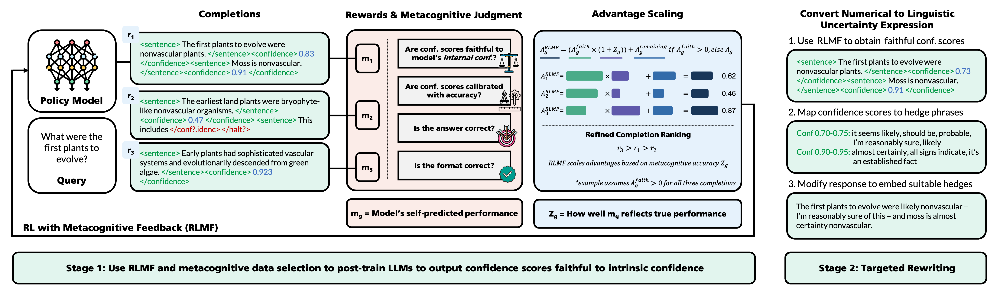

# Reinforcement Learning with Metacognitive Feedback Elicits Faithful Uncertainty Expression in LLMs

Metacognition is a critical component of intelligence which describes the ability to monitor and regulate one’s own cognitive processes. Yet LLMs exhibit systemic deficiencies in key metacognitive faculties. Since monitoring task performance and adapting behavior accordingly are central to metacognition, we posit that _models capable of accurately judging their own performance are better positioned to improve it._

We operationalize this idea via two novel mechanisms, implemented in this repository: _reinforcement learning with metacognitive feedback_ (RLMF), a novel paradigm to refine completion rankings during preference optimization based on the quality of a model’s self-judgments of performance (i.e., metacognitive accuracy), and _metacognitive data selection,_ which leverages similar self-judgments to identify high-value training examples, outperforming naive active learning. 

<!-- Metacognition is a critical component of intelligence, yet LLMs exhibit systemic deficiencies in key metacognitive faculties. We posit that _models capable of accurately judging their own performance are better positioned to improve it._ -->

<!-- This repository contains the code to implement -->
<!-- _reinforcement learning with metacognitive feedback_ (RLMF), a novel paradigm to refine completion rankings during preference optimization based on the quality of a model’s self-judgments of performance (i.e., metacognitive accuracy), and _metacognitive data selection,_ which leverages similar self-judgments to identify high-value training examples, outperforming naive active learning.  -->

Through extensive experiments, we show RLMF surpasses standard RL by up to 63%, while enhancing models’ ability to self-assess and express their own capability limits, achieving state-of-the-art faithful calibration in a generalized fashion across diverse models and tasks. This provides promising evidence that metacognitive performance can be an effective internal feedback signal that overcomes limitations of prior intrinsic feedback methods. It also suggests RLMF as a potential paradigm to encode improved metacognitive awareness into LLMs toward improved abilities and aligment.

<!-- for achieving stronger and more stable post-training while encoding improved metacognitive awareness into LLMs  -->
<!-- Overall, our results suggest RLMF as a promising paradigm for achieving stronger and more stable post-training while encoding improved metacognitive awareness into LLMs, and suggests metacognitive performance as a particularly effective internal feedback signal for RL that can overcome limitations of prior intrinsic feedback methods. -->

<!-- wherein the goal is to align models' expressed with intrinsic uncertainty, challenging even for frontier LLMs. Beyond achieving generalizable, state-of-the-art faithful calibration of LLMs across diverse models and tasks,  -->

<!-- The premise of RLMF is our proposition that teaching a model to accurately predict its own task performance in an on-policy fashion can meaningfully improve post-training results by enhancing the model’s metacognitive awareness. -->

<!-- <p align="center">
  
</p> -->

<p align="center">
    <a href="https://arxiv.org/pdf/2606.32032" style="display:inline-block;background-color:#2196F3;color:white;padding:10px 20px;text-align:center;text-decoration:none;font-size:20px;border-radius:5px;">📄 <b>Paper</b></a>
</p>

<p align="center">
  
</p>


## Quick Links

- [🛠 Installation](#installation)
- [📂 File Structure](#structure)
- [📊 Experiments](#experiments)
    - [📐 Baseline Evaluation](#exp0)
    - [🎯 Stronger Baseline Evaluation](#exp1)
    - [🧩 Train Models with RLMF](#exp2)
    - [📝 Map Numerical to Linguistic Confidence](#exp3)
- [💬 Example Generations](#examples)
- [🗂 Citation](#citation)

<a name="installation"></a> 

## 🛠 Installation

After cloning and navigating into the repository, create a conda environment and install the required dependencies:
```bash
conda create --name rlmf_env python=3.11
conda activate rlmf_env
pip install -r reqs.txt
python -m spacy download en_core_web_sm
conda install -c conda-forge jq
```
Specify your API keys to access proprietary and HuggingFace models:

```bash
export GOOGLE_API_KEY="your_api_key_here"
export OPENAI_API_KEY="your_api_key_here"
export HF_TOKEN="your_huggingface_key_here"
```
To track training runs and log experimental metrics in [W&B](https://wandb.ai/site/), set your W&B username and target project name:
```bash
export WANDB_ENTITY="your_user_name_here"
export WANDB_PROJECT="RLMF"     # or other project name of choice
```
Lastly, download the UMWP dataset [here](https://github.com/Yuki-Asuuna/UMWP/blob/main/data/StandardDataset.jsonl), rename the file to `umwp.jsonl`, and place it in the `src/exp0_baseline/data` directory.

## 📂 File Structure

- `src/`: Core training and evaluation code.
  - `exp0_baseline/`: Code to obtain baseline faithful calibration results for original models.
    - `data/`: Directory to store local data files for datasets not hosted on HuggingFace.
      - `umwp.jsonl/`: Data file for the UMWP dataset, obtained and renamed per the [Installation directions](#installation).
    - `metrics/`: Implementation of metrics to quantify faithful calibration.
      - `assertions.py`: Code to extract atomic assertions from model responses.
      - `decisiveness.py`: Code to quantify linguistic decisiveness of model assertions.
      - `faithfulness_batch.py`: Code to score instance-level faithful calibration for a batch of samples.
      - `faithfulness.py`: Code to score instance-level faithful calibration for a single sample.
      - `uncertainty.py`: Code to quantify models' intrinsic confidence in assertions.
    - `prompts/`: Prompts used for LLM evaluations.
      - `__init__.py`: Registry of all uncertainty elicitation prompts and task prompts.
      - `input_prompts.py`: String formatting for instance-level inputs.
      - `task_prompts.py`: String formatting for different task types. Used jointly with input prompts.
      - `hedge_prompts.py`: Baseline uncertainty elicitation prompts.
      - `scoring_prompts.py`: Prompts used for LLM-as-a-Judge-based assertion extraction and evaluation of decisiveness, consistency across sampled responses, and task accuracy.
    - `scripts/`: Code for inference and scoring.
      - `_sample_commands.sh`: Example commands to run inference and scoring for Qwen3 family.
      - `run_all_datasets_vllm.sh`: Run inference on all datasets for a single model and hedge prompt.
      - `run_exp_vllm.py`: Main run script for open-source model inference experiments. Called by `run_all_datasets_vllm.sh`.
      - `run_score_vllm.sh`: Score faithfulness on all datasets for a single model and hedge prompt.
      - `score_cmd_vllm.sh`: Script to construct and run the scoring command for a single model x dataset x prompt combination. Called by `run_score_vllm.sh`.
      - `score_exp_vllm.py`: Main run script for open-source model scoring experiments. Called by `score_cmd_vllm.sh`.
    - `tasks/`: Module to prepare datasets/tasks for evaluation.
    - `utilties/`: Utility functions, including dataset-level evaluation metrics.
  - `exp1_metafaith/`: Code to obtain baseline faithful calibration results using MetaFaith prompting ([Liu et al., 2025](https://aclanthology.org/2025.emnlp-main.1505/)).
    - `_sample_commands.sh`: Example commands to run inference and scoring for Qwen3-1.7B and Gemini-3-Flash and compile the results.
    - `compile_metrics.py`: Code to compile results across all tasks for easy viewing for a particular model.
    - `data_utils.py`: Utility functions to prepare inputs and targets per dataset.
    - `inference_and_score.py`: Main code to run and score model predictions.
    - `run_inference.sh`: Script to launch predictions for all datasets for a particular model.
    - `run_score.sh`: Script to launch scoring for all predictions for a particular model.
    - `sys_prompts.py`: Metacognitive system prompt used for MetaFaith baseline experiments.
  - `exp2_rlmf/`: Code to run our main RL experiments, including pre-SFT, metacognitive data selection, RLMF training, standard RL training, and evaluation.
    - `a_pre_sft/`: Code to run pre-SFT to teach models our custom output format for outputting sentence-level confidence scores.
      - `_sample_commands.sh`: Example commands to generate pre-SFT data and run the training for Qwen3-4B.
      - `get_predictions.py`: Script to generate raw data for pre-SFT stage.
      - `qwen3_4b.ipynb`: Code to run pre-SFT for Qwen3-4B, which can be adapted for other models by simply changing the model name in the notebook.
    - `b_metacog_data_selection/`: Code to run metacognitive data selection for any model of choice.
      - `sampled_answers_lists/`: Directory where sampled answers per datapoint are saved after running `save_sampled_answers.py` for a given model.
      - `score_dfs/`: Directory where scores per datapoint are saved for a given model.
      - `_sample_commands.sh`: Example commands to obtain metacognitive scores per sample in the PopQA training set for Qwen3-8B.
      - `save_sampled_answers.py`: Script to generate and save K=20 sampled answers per datapoint for a given model.
      - `dynamic_score_samples.py`: Script to generate metacognitive scores per datapoint for a given model, after answers are sampled.
      - `dynamic_score_samples_by_gold_faithfulness.py`: Script to obtain gold faithful calibration scores per datapoint for a given model, after answers are sampled. Used to implement the active learning baseline to which our metacognitive data selection strategy is compared.
      - `combine_dfs_for_model.py`: Script to compile chunked scoring results into a single CSV.
    - `c_rl_training/`: Code to run either standard RL or RLMF for faithful calibration of any model of choice, optionally in combination with a special data selection strategy.
      - `_sample_commands.sh`: Example commands to run RLMF training of Llama3.1-8B-Instruct on PopQA, assuming no pre-SFT, and subsequent evaluation. Evaluation uses the code in the `src/exp2_rlmf/d_evaluate` subdirectory.
      - `rlmf_trainer.py`: Subclassed GRPOTrainer; implements our proposed metacognitive advantage scaling for RLMF.
      - `grpo.py`: Main training script.
      - `rewards.py`: Implementation of reward functions for faithful calibration.
      - `sample_config.py`: Example training configuration to reproduce our experiments. This configuration is used to train Llama3.1-8B-Instruct with RLMF and metacognitive data selection on PopQA (but without pre-SFT).
    - `d_evaluate/`: Code to run inference and scoring on the test set of each task for any model of choice, compile the results, and run quantitative and qualitative analysis.
      - `inference.py`: Main script to run inference and scoring of numerical faithful calibration for a given model on a given dataset.
      - `rescore.py`: Script to compute final metrics and LLM-as-a-Judge scoring for a given model or checkpoint.
      - `evaluate_checkpoints.sh`: Code to evaluate all model checkpoints of a given training setting on the in-domain task's test set. 
      - `evaluate_all_datasets.sh`: Code to evaluate a given checkpoint on all tasks.
      - `compile_results.py`: Code to compile results across all checkpoints for a given training setting.
      - `compile_scores_from_all_datasets.py`: Code to compile results across all tasks for a given trained model checkpoint.
      - `analyze_conf_bins.py`: Code to analyze faithfulness and intrinsic vs. expressed confidence per size-0.1 intrinsic confidence bin for a given model.
      - `analyze_qualitative.py`: Code to plot visualizations of a given model's faithfulness distribution and other associated properties.
    - `utils/`: Additional data and scoring utility functions.
  - `exp3_rewriting/`: Code to run the rewriting step of our pipeline for faithful calibration of LLMs, to map from numerical to linguistic uncertainty in a principled fashion.
    - `hedge_extraction/`: Code used to construct the numerical-linguistic confidence map, and the final mapping used in our experiments.
    - `_sample_commands.sh`: Example commands to run and evaluate rewriting step outputs for Llama3.1-8B-instruct.
    - `prompts.py`: Prompts used in rewriting step.
    - `rewrite.py`: Code to implement rewriting step.
    - `rewrite.sh`: Main script to run and score rewriting results for a given model on all tasks.
    - `compile_linguistic_scores.py`: Code to update existing recorded metrics with scoring artifacts from the rewriting step.
- `figs/`: Directory storing the representative diagram of our method.
- `demos/`: Directory containing sample responses produced with our two-stage faithful calibration framework vs. with Faithful Uncertainty Tuning (FUT) ([Eikema et al., 2025](https://arxiv.org/abs/2510.12587)).
- `reqs.txt`: Dependencies for environment creation.


<a name="experiments"></a> 

## 📊 Experiments

<a name="exp0"></a> 
### 📐 0. Evaluate Faithful Calibration of Original Models (Simple Baseline)

To evaluate the faithful calibration level of models as-is, without applying any faithful calibration strategies, run the following. All code for this experimental setting is in `src/exp0_baseline/`. The code below is a demonstration for Qwen3 models, also accessible in `src/exp0_baseline/scripts/_sample_commands.sh`. We use the prompts from [Liu et al., 2025](https://aclanthology.org/2025.emnlp-main.1505/) as a neutral baseline and obtain final baseline scores by taking the best result per model per dataset. Note that we do _not_ evaluate proprietary models in this setting and instead opted to use a [stronger baseline](#exp1) for models such as GPT-5.

```bash
### Baseline Faithful Calibration Evaluation (Original Models)

export PYTHONPATH=$(pwd); cd src

# Get Predictions for All Models
bash ./exp0_baseline/scripts/run_all_datasets_vllm.sh  Qwen/Qwen3-0.6B  basic 
bash ./exp0_baseline/scripts/run_all_datasets_vllm.sh  Qwen/Qwen3-0.6B  blank 
bash ./exp0_baseline/scripts/run_all_datasets_vllm.sh  Qwen/Qwen3-0.6B  genuine 
bash ./exp0_baseline/scripts/run_all_datasets_vllm.sh  Qwen/Qwen3-0.6B  human 
bash ./exp0_baseline/scripts/run_all_datasets_vllm.sh  Qwen/Qwen3-0.6B  perception 

bash ./exp0_baseline/scripts/run_all_datasets_vllm.sh  Qwen/Qwen3-1.7B  basic 
bash ./exp0_baseline/scripts/run_all_datasets_vllm.sh  Qwen/Qwen3-1.7B  blank 
bash ./exp0_baseline/scripts/run_all_datasets_vllm.sh  Qwen/Qwen3-1.7B  genuine 
bash ./exp0_baseline/scripts/run_all_datasets_vllm.sh  Qwen/Qwen3-1.7B  human 
bash ./exp0_baseline/scripts/run_all_datasets_vllm.sh  Qwen/Qwen3-1.7B  perception 

bash ./exp0_baseline/scripts/run_all_datasets_vllm.sh  Qwen/Qwen3-4B-Instruct-2507  basic 
bash ./exp0_baseline/scripts/run_all_datasets_vllm.sh  Qwen/Qwen3-4B-Instruct-2507  blank 
bash ./exp0_baseline/scripts/run_all_datasets_vllm.sh  Qwen/Qwen3-4B-Instruct-2507  genuine 
bash ./exp0_baseline/scripts/run_all_datasets_vllm.sh  Qwen/Qwen3-4B-Instruct-2507  human 
bash ./exp0_baseline/scripts/run_all_datasets_vllm.sh  Qwen/Qwen3-4B-Instruct-2507  perception 

bash ./exp0_baseline/scripts/run_all_datasets_vllm.sh  Qwen/Qwen3-8B  basic 
bash ./exp0_baseline/scripts/run_all_datasets_vllm.sh  Qwen/Qwen3-8B  blank 
bash ./exp0_baseline/scripts/run_all_datasets_vllm.sh  Qwen/Qwen3-8B  genuine 
bash ./exp0_baseline/scripts/run_all_datasets_vllm.sh  Qwen/Qwen3-8B  human 
bash ./exp0_baseline/scripts/run_all_datasets_vllm.sh  Qwen/Qwen3-8B  perception 

# Score Predictions for All Models
# Note: Model names can be changed in src/exp0_baseline/scripts/run_score_vllm.sh
bash ./exp0_baseline/scripts/run_score_vllm.sh  popqa 
bash ./exp0_baseline/scripts/run_score_vllm.sh  simpleqa 
bash ./exp0_baseline/scripts/run_score_vllm.sh  selfaware 
bash ./exp0_baseline/scripts/run_score_vllm.sh  sciq 
bash ./exp0_baseline/scripts/run_score_vllm.sh  math 
bash ./exp0_baseline/scripts/run_score_vllm.sh  umwp 
bash ./exp0_baseline/scripts/run_score_vllm.sh  mmlu 
bash ./exp0_baseline/scripts/run_score_vllm.sh  halueval 
bash ./exp0_baseline/scripts/run_score_vllm.sh  arc_challenge 
bash ./exp0_baseline/scripts/run_score_vllm.sh  superglue 
```

Note that you may need to set the `CUDA_VISIBLE_DEVICES` variable before launching experiments to use the correct GPU(s). 

<a name="exp1"></a> 
### 🎯 1. Apply MetaFaith to Improve Faithful Calibration of Models (Stronger Baseline)

To obtain a stronger baseline, we apply [MetaFaith](https://aclanthology.org/2025.emnlp-main.1505/) (metacognitive prompting) to improve the faithful calibration of models. This can be done by running the following. All code for this experimental setting is in `src/exp1_metafaith/`. The code below provides demonstration for one open-source and one proprietary model, and is also accessible in `src/exp1_metafaith/_sample_commands.sh`.

```bash
### Baseline Faithful Calibration with MetaFaith Prompting (Liu et al., 2025)

export PYTHONPATH=$(pwd); cd src

# Sample Run + Score Commands for Gemini-3-Flash
bash ./exp1_metafaith/run_inference.sh gemini-3-flash-preview 1000
bash ./exp1_metafaith/run_score.sh gemini-3-flash-preview 1000 1
bash ./exp1_metafaith/run_score.sh gemini-3-flash-preview 1000 2 8002
bash ./exp1_metafaith/run_score.sh gemini-3-flash-preview 1000 3

# Sample Run + Score Commands for Qwen3-1.7B
bash ./exp1_metafaith/run_inference.sh Qwen/Qwen3-1.7B 1000
bash ./exp1_metafaith/run_score.sh Qwen/Qwen3-1.7B 1000 1
bash ./exp1_metafaith/run_score.sh Qwen/Qwen3-1.7B 1000 2 8002
bash ./exp1_metafaith/run_score.sh Qwen/Qwen3-1.7B 1000 3

# Sample Result Compilation Commands
python ./exp1_metafaith/compile_metrics.py --dir ./exp1_metafaith/_results/gemini_3_flash_preview
python ./exp1_metafaith/compile_metrics.py --dir ./exp1_metafaith/_results/Qwen_Qwen3_1.7B
```
Here, the scoring is split into three "modes" which enable parallelization of the scoring of linguistic decisiveness (mode 1) and intrinsic confidence (mode 2) of models. Mode 3 simply aggregates the results of modes 1 and 2 once they are complete to compute overall faithful calibration metrics. 

Note that mode 2 scoring requires first serving Qwen3-32B as the judge model for consistency judgments during intrinsic confidence estimation. This can be done via: 
```bash
vllm serve Qwen/Qwen3-32B-FP8 --tensor-parallel-size 1  --trust-remote-code  --gpu-memory-utilization 0.8  --max-model-len 4096  --port 8002 --chat-template ./exp1_metafaith/qwen3_nonthinking.jinja
```
Here, the nonthinking template must be first obtained from the official [Qwen3 repository](https://github.com/QwenLM/Qwen3/blob/main/docs/source/assets/qwen3_nonthinking.jinja). Be sure to set the `port` flag to the desired port (and update this in the mode 2 scoring command), and set the `CUDA_VISIBLE_DEVICES` variable to use the correct GPU(s). In our experiments, one 48GB A6000 was sufficient to serve the judge model.

<a name="exp2"></a> 
### 🧩 2. Train Models with RLMF Toward Improved Faithfulness & Metacognitive Awareness

To apply RLMF with metacognitive data selection to improve the faithfulness of models' self-reported confidence scores, and encode improved metacognitive awareness into LLMs, run the following. All code for this experimental setting is in `src/exp2_rlmf/`. The code below demonstrates the process for Llama3.1-8B-Instruct and is also accessible in `src/exp2_rlmf/c_rl_training/_sample_commands.sh`. Note that for this example, we assume no pre-SFT for simplicity.

Important Notes:

* **How to Run Pre-SFT**: For a demonstration of how to run the pre-SFT procedure to teach models our custom output format prior to RL training, see and follow the commands in `src/exp2_rlmf/a_pre_sft/_sample_commands.sh`. 

* **How to Obtain Per-Datapoint Scores for Metacognitive Data Selection**: For a demonstration of how to obtain scores per datapoint to use for metacognitive data selection, or for the active learning baseline to which we compared metacognitive data selection in the paper, see `src/exp2_rlmf/b_meatcog_data_selection/_sample_commands.sh`.

* **Reproducing Main Results**: To reproduce our main results in the numerical setting (i.e., faithful calibration of models' self-reported sentence-level confidence scores), obtained by combining RLMF with metacognitive data selection, it must be that: (1) the model has already undergone pre-SFT per the code in `src/exp2_rlmf/a_pre_sft`, and (2) metacognitive scores from the model have already been obtained for all training datapoints in consideration per the code in `src/exp2_rlmf/b_metacog_data_selection`.

* **Training Configuration**: The example below uses the training configuration specified in `src/exp2_rlmf/c_rl_training/sample_config.py`, which provides the arguments and hyperparameter settings used to implement our main approach combining RLMF with metacognitive data selection. However, alternative configurations are possible, and the config file contains comments describing how it can be adapted to implement other training setups.

* **GPU Usage**: At a minimum, 3 GPUs are required to run RLMF training in the default setup. One GPU must serve the judge model for consistency of sampled responses (used to estimate intrinsic confidence per sentence), one GPU must serve the model being trained as a [dedicated inference server](https://huggingface.co/docs/trl/main/en/grpo_trainer#option-2-server-mode) for GRPO rollout (note this can be omitted with [colocate mode](https://huggingface.co/docs/trl/main/en/grpo_trainer#option-1-colocate-mode)), and at least one GPU must be used for training (we use 4 GPUs with DDP to accelerate the process and accommodate a larger batch size). These are demonstrated in **Steps 1-3** in the sample code below. Following this setup, the sample code assumes simultaneous use of **6** GPUs. 
  
  Optionally, two additional GPUs can be used to evaluate in-domain test performance on each saved checkpoint in parallel with training. This is demonstrated in **Step 4** of the sample code below.

```bash
### Run RL(MF) Training of Models to Improve Their Faithful Calibration

export PYTHONPATH=$(pwd); cd src

## Sample Training Commands for Llama3.1-8B-Instruct (No Pre-SFT) on PopQA

# Step 1: Serve Judge Model for Consistency Judgments for Online Intrinsic Confidence Estimation
# Here, the nonthinking template must be first obtained from https://github.com/QwenLM/Qwen3/blob/main/docs/source/assets/qwen3_nonthinking.jinja.
export CUDA_VISIBLE_DEVICES=0; vllm serve Qwen/Qwen3-32B-FP8 --tensor-parallel-size 1  --trust-remote-code  --gpu-memory-utilization 0.8  --max-model-len 4096  --port 8000 --chat-template ./exp2_rlmf/qwen3_nonthinking.jinja

# Step 2: Serve Model Being Trained via TRL+VLLM for GRPO Rollout
# Note: If running RLMF training for the model after pre-SFT is completed, this command must use the path to the resulting merged model weights instead.
export CUDA_VISIBLE_DEVICES=1; trl vllm-serve --model meta-llama/Meta-Llama-3.1-8B-Instruct  --trust-remote-code  --max-model-len 4096 --port 8001 --gpu-memory-utilization 0.9

# Step 3: Launch Training 
# Note: The sample command here uses the example training configuration provided at `src/exp2_rlmf/c_rl_training/sample_config.py`, but the config file can be adapted to use alternative arguments, which are described in comments in the file. 
# If resuming training from a checkpoint, add the flag `--resume_from_checkpoint` and, optionally, the ID of the wandb run to continue from with the flag `--wandb_run_id` followed by the run ID.
export CUDA_VISIBLE_DEVICES=2,3,4,5; torchrun --nproc_per_node=4 ./exp2_rlmf/c_rl_training/grpo.py --config_path  ./exp2_rlmf/c_rl_training/sample_config.py --use_sys_instruction  --judge_hostnum 8000 

# Step 4: Simultaneously Evaluate Checkpoints on In-Domain Test Set
# First, serve another judge model to perform consistency judgments for intrinsic confidence estimation during evaluation.
export CUDA_VISIBLE_DEVICES=6; vllm serve Qwen/Qwen3-32B-FP8 --tensor-parallel-size 1  --trust-remote-code  --gpu-memory-utilization 0.8  --max-model-len 4096  --port 8002 --chat-template ./exp2_rlmf/qwen3_nonthinking.jinja
# Then, run the evaluation on another GPU, making sure that the model directory is consistent in name with the `run_name` argument in the training config file.
export CUDA_VISIBLE_DEVICES=7; bash ./exp2_rlmf/d_evaluate/evaluate_checkpoints.sh  8002 ./exp2_rlmf/c_rl_training/__models/meta_llama_Llama_3.1_8B_Instruct/Llama3.1_8B_Ins_popqa_RLMF_MDS_BS64_N2000_LR5e-6 100 1500 100
```
Continuing the example above, to compile the _in-domain_ test evaluation results for all checkpoints to determine which is best-performing, run:

```bash
python ./exp2_rlmf/d_evaluate/compile_results.py --test_results_dir ./exp2_rlmf/c_rl_training/__models/meta_llama_Llama_3.1_8B_Instruct/Llama3.1_8B_Ins_popqa_RLMF_MDS_BS64_N2000_LR5e-6 --dataset_name=popqa
```

To evaluate the best checkpoint on all downstream tasks and compile the results (this example assumes checkpoint 600 was the best), run:
```bash
# Step 5: Evaluate Best Checkpoint on Out-of-Distribution Tasks
# First, run the OOD evaluations.
export CUDA_VISIBLE_DEVICES=7; bash ./exp2_rlmf/d_evaluate/evaluate_all_datasets.sh  8002 ./exp2_rlmf/c_rl_training/__models/meta_llama_Llama_3.1_8B_Instruct/Llama3.1_8B_Ins_popqa_RLMF_MDS_BS64_N2000_LR5e-6 600 
# Then, compile all the results into a single CSV for easy visualization. Here, the `test_results` sub-directory is automatically created during Steps 4 and 5 above.
python ./exp2_rlmf/d_evaluate/compile_scores_from_all_datasets.py ./exp2_rlmf/c_rl_training/__models/meta_llama_Llama_3.1_8B_Instruct/Llama3.1_8B_Ins_popqa_RLMF_MDS_BS64_N2000_LR5e-6/test_results/checkpoint_600

# Step 6: Compute Final Scores and cMFG*
python ./exp2_rlmf/d_evaluate/rescore.py --results_dir=./exp2_rlmf/c_rl_training/__models/meta_llama_Llama_3.1_8B_Instruct/Llama3.1_8B_Ins_popqa_RLMF_MDS_BS64_N2000_LR5e-6/test_results/checkpoint_600
```

Lastly, additional visualizations and analysis can be run with the following commands, which assume use of the same best checkpoint as above:
```bash
# Step 7: Additional Analysis
# Option A: Analyze average faithful calibration per size-0.1 intrinsic confidence bin
python ./exp2_rlmf/d_evaluate/analyze_conf_bins.py ./exp2_rlmf/c_rl_training/__models/meta_llama_Llama_3.1_8B_Instruct/Llama3.1_8B_Ins_popqa_RLMF_MDS_BS64_N2000_LR5e-6/test_results/checkpoint_600
# Option B: Plot visualizations of model's faithfulness distribution and other associated properties; this can be run per dataset; the example below does so for PopQA results
python ./exp2_rlmf/d_evaluate/analyze_qualitative.py --model_name "my_model_name_for_plot_title" --input_score_json_path=./exp2_rlmf/c_rl_training/__models/meta_llama_Llama_3.1_8B_Instruct/Llama3.1_8B_Ins_popqa_RLMF_MDS_BS64_N2000_LR5e-6/test_results/checkpoint_600/test_scores_popqa.json
```

<a name="exp3"></a> 
### 📝 3. Map Faithful Confidence Scores to Faithful Linguistic Uncertainty Expressions

To further capitalize on the merits of RLMF, we use targeted editing of model outputs to enable faithful linguistic uncertainty expression that is dynamically adaptable across scenarios and generalizable to long-form tasks. This decoupled approach ensures linguistic uncertainty expressions (1) can be tailored and modified to suit user preferences and other context without repeating costly RL training, and (2) are diverse, since RL is prone to mode collapse and faithful calibration metrics do not penalize hedge repetition.

We construct a principled mapping from confidence scores to hedge expressions using the code in `src/exp3_rewriting/hedge_extraction`, and apply strategic rewriting to incorporate these into model outputs. This process is demonstrated via the example commands below. Note that these commands assume the same model and setup as in the previous section; they can also be found in `src/exp3_rewriting/_sample_commands.sh`.

```bash
### Map Faithful Numerical Confidence Expressions to Linguistic (Natural Language) Uncertainty

# Step 1: Run rewriting step for all datasets
# Note: Set the last arg to 0 to skip faithfulness scoring and only complete the numerical -> linguistic confidence transformation
bash ./exp3_rewriting/rewrite.sh ./exp2_rlmf/c_rl_training/__models/meta_llama_Llama_3.1_8B_Instruct/Llama3.1_8B_Ins_popqa_RLMF_MDS_BS64_N2000_LR5e-6/test_results/checkpoint_600  gemini-2.5-flash-lite  all  20  1

# Step 2: Compile results into easily visualizable form
# Note: This command must specify the same rewriting model, rewriting mode, and # of hedges per confidence bin as in the Step 1 command
python ./exp3_rewriting/compile_linguistic_scores.py --dir=./exp2_rlmf/c_rl_training/__models/meta_llama_Llama_3.1_8B_Instruct/Llama3.1_8B_Ins_popqa_RLMF_MDS_BS64_N2000_LR5e-6/test_results/checkpoint_600 --mode all --bin_size 20 --model gemini-2.5-flash-lite
```

The rewriting model can be switched to, e.g., GPT-5-Mini, by simpling replacing `gemini-2.5-flash-lite` in the commands above with `gpt-5-mini` (or any other GPT or Gemini model of choice). The rewriting strategy can be altered by changing `all` to `iter` or `easy`; `iter` represents a more fine-grained two-step approach that combines sentence-level and whole-response revisions, while `easy` uses only a single pass of sentence-level edits. Lastly, the number of candidate hedge expressions provided per size-0.05 confidence bin can be toggled by changing `20` to, e.g., `5` or `10` in the example commands.

<a name="examples"></a> 

## 💬 Example Generations

We provide example generations produced by Llama3.1-8B-Instruct on the datasets PopQA, SciQ, and SelfAware following application of our two-stage framework versus Faithful Uncertainty Tuning (FUT) ([Eikema et al., 2025](https://arxiv.org/abs/2510.12587)) in `demos/example_outputs.json`; one example per dataset is previewed below. FUT represents the prior state of the art and uses supervised fine-tuning to improve faithful calibration of LLMs. A portion of these examples were evaluated by human experts in our annotation study, which revealed that our framework yields faithful linguistic uncertainty expressions that are much more diverse, natural, helpful, and context-adaptable.

<details>
<summary><b>PopQA Example:</b> "Who was the producer of Compliance?"</summary>

**Ours**
> The film was produced by Sophia Lin, though I'm not very confident in this answer.

> My best guess is that Compliance was produced by Magnolia Pictures, but I could easily be wrong.

> I vaguely recall that the producer might be tied to Oscilloscope Laboratories, but I wouldn't stake much on that.

**FUT**
> It is quite likely that the producer of "Compliance" is unknown to me.

> It is somewhat doubtful that the producer of the 2012 film "Compliance" is Steven Soderbergh.

> It is very likely that I do not have enough information to determine who produced "Compliance."

</details>


<details>
<summary><b>SciQ Example:</b> "What soil is common in deciduous forests?"</summary>

**Ours**
> Pedalfer soils are associated with deciduous forests and rich in nutrients, have high fertility, and are typically yellow, brown, or reddish in color.

> I believe alfisols are the soils most commonly associated with temperate deciduous forests — they tend to be moderately fertile with a well-developed horizon structure — but I hold that with only moderate confidence.

> My tentative understanding is that deciduous forests are often underlain by relatively nutrient-rich soils with significant organic matter in the upper horizons, though I can't confidently name the specific soil order.

**FUT**
> It is quite likely that the correct answer is alfisol or temperate forest soil.

> It is somewhat doubtful that sandy soil is the correct answer.

> It is likely that the correct answer involves fertile, loamy soils with good organic content.

</details>

<details>
<summary><b>SelfAware Example:</b> "What was the first plant to have its genome sequenced?"</summary>

**Ours**
> It is a well-established fact that the tobacco plant was the first plant to have its genome sequenced.

> My understanding is that Arabidopsis thaliana was the first plant to have its nuclear genome fully sequenced, completed in 2000 — though I'd note that earlier partial sequencing work was done on other species, which may be the source of some conflicting claims.

> I believe Arabidopsis thaliana holds this distinction, as it was a deliberate choice as a model organism for the first complete plant genome project, but I'd recommend verifying this against primary sources as I hold this with only moderate confidence.

**FUT**
> It is quite likely that Arabidopsis thaliana was the first plant to have its genome sequenced.

> It is somewhat doubtful that the tobacco plant was the first plant to have its complete genome sequenced.

> It is very likely that Arabidopsis thaliana, a model organism in plant biology, was the first plant to have its genome fully sequenced.

</details>

<a name="citation"></a> 

## 🗂 Citation

If you find the content of this project helpful, please cite our paper as follows:
```bibtex
@misc{liu2026reinforcement,
      title={Reinforcement Learning with Metacognitive Feedback Elicits Faithful Uncertainty Expression in LLMs}, 
      author={Gabrielle Kaili-May Liu and Avi Caciularu and Gal Yona and Idan Szpektor and Arman Cohan},
      journal={arXiv preprint arXiv:2606.32032},
      year={2026},
      url={https://arxiv.org/abs/2606.32032}, 
}
```
